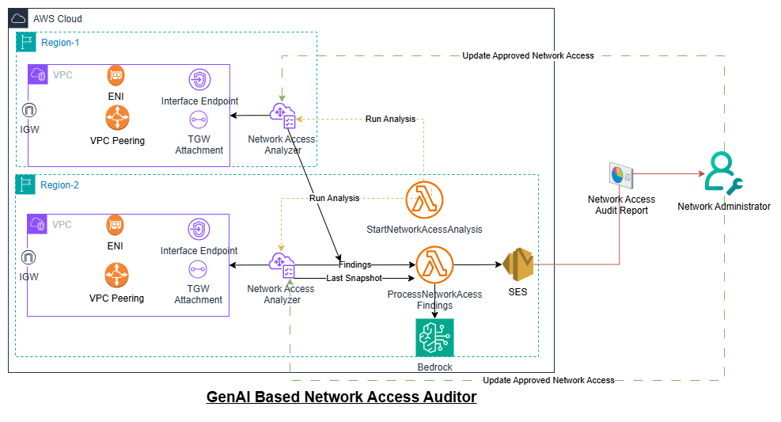
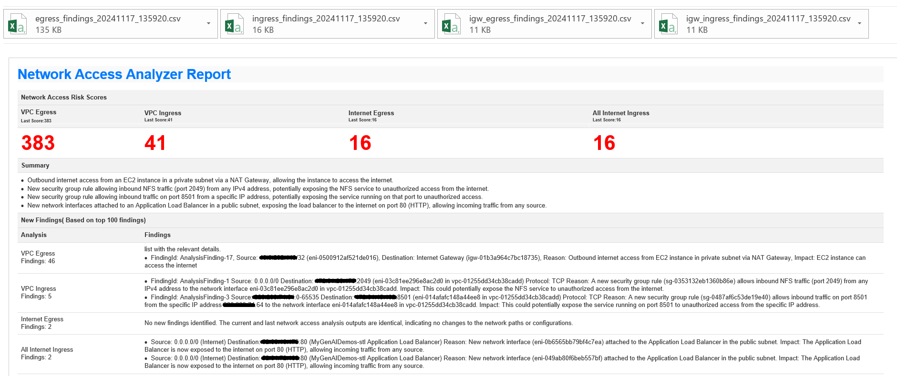

# GenAI Based Network Access Auditor

## Overview

The GenAI Based Network Access Auditor is a comprehensive solution designed to address the challenges of monitoring and securing dynamic AWS network infrastructures. As cloud environments grow increasingly complex, it becomes difficult to maintain visibility and control over network access permissions, potentially leading to security gaps and unintended access to critical resources.

## Problem Statement

AWS network infrastructures can grow vast, making it challenging to monitor the network space in a dynamic environment. This often results in gaps in network security and unintended access to critical resources, posing significant risks to organizations.

## What is Network Access Analyzer?

[Network Access Analyzer](https://docs.aws.amazon.com/vpc/latest/network-access-analyzer/what-is-network-access-analyzer.html) is a feature that identifies unintended network access to your resources on AWS. You can use Network Access Analyzer to specify your network access requirements and to identify potential network paths that do not meet your specified requirements. You can use Network Access Analyzer to:

Understand, verify, and improve your network security posture – Network Access Analyzer helps you identify unintended network access relative to your security and compliance requirements, enabling you to take steps to improve your network security.

Demonstrate compliance – Network Access Analyzer helps you demonstrate that your network on AWS meets your compliance requirements

## Solution

The GenAI Based Network Access Auditor leverages the power of Generative AI (GenAI) to automate the analysis and auditing of network access permissions across multiple AWS regions. By periodically monitoring network configurations and comparing them against approved baselines, this solution provides organizations with a consolidated view of their network security posture, enabling proactive mitigation of potential risks.

## Key Features

1. **Periodic Network Access Analysis**: The solution runs weekly/monthly network access analysis across different AWS regions, ensuring comprehensive coverage of your dynamic cloud environment.

2. **Consolidated Reporting and Scoring**: The analysis generates a consolidated report with a scoring system, providing network administrators with a clear overview of the organization's network security posture.

3. **Change Tracking and Gap Identification**: By comparing the current findings with previous snapshots, the solution leverages Amazon Bedrock to identify critical gaps and new findings, enabling timely remediation efforts.

4. **Approved Network Access Baseline**: Network administrators can update an exclusion list to define approved network access permissions, creating a baseline for authorized access within the organization.

## Architecture



### Components

1. **Network Access Analyzer**: The AWS service responsible for evaluating network access permissions and generating findings.
2. **Event Bridge Schedule**: The AWS service responsible for invoking Lambda functions weekly/monthly for running network access analysis.
3. **StartNetworkAccessAnalysis**: A Lambda function that initiates the network access analysis process.
4. **ProcessNetworkAccessFindings**: A Lambda function that processes the analysis findings and prepares them for further analysis.
5. **Amazon Bedrock**: Amazon Bedrock, an AI service that provides advanced analysis and recommendations based on the network access findings.
6. **Amazon SES**: Amazon Simple Email Service, used to deliver the consolidated Network Access Audit Report to network administrators.
7. **Network Administrator**: The recipient of the Network Access Audit Report, responsible for reviewing and taking appropriate actions based on the findings.

## Workflow

1. The solution periodically triggers the `StartNetworkAccessAnalysis` Lambda function, which initiates a network access analysis across multiple AWS regions.
2. The `Network Access Analyzer` service evaluates the network access permissions and generates findings based on the current configurations.
3. The `ProcessNetworkAccessFindings` Lambda function retrieves the analysis findings and compares them with the last snapshot (if available) to identify changes and new findings.
4. The processed Top 100 findings are then sent to Amazon Bedrock for further analysis.
5. Bedrock leverages the power of Generative AI to provide insights, recommendations, and a consolidated report on the organization's network security posture.
6. The consolidated Network Access Audit Report, including the AI-generated analysis and recommendations, is delivered to the network administrator via Amazon SES.
7. Network administrators can review the report, take necessary actions to mitigate identified risks, and update the approved network access baseline (exclusion list) as needed.

## Benefits

- **Proactive Security Monitoring**: Periodically monitor and analyze network access permissions, enabling proactive identification and mitigation of potential security risks.
- **Comprehensive Visibility**: Gain a consolidated view of your organization's network security posture across multiple AWS regions.
- **AI-Powered Insights**: Leverage the power of Generative AI to receive actionable insights and recommendations for improving network security.
- **Baseline Enforcement**: Establish and maintain an approved network access baseline, ensuring alignment with organizational policies and best practices.
- **Efficient Resource Management**: Optimize resource allocation and reduce operational overhead by automating network access auditing and analysis processes.

## Cost and ROI

The cost of running the GenAI Based Network Access Auditor solution will depend on several factors, including the number of AWS regions monitored, Number of ENIs analyzed, the frequency of analysis, and the usage of various AWS services involved ie Amazon Bedrock, Anthropic Claude Model.

By proactively identifying and addressing network security gaps, organizations can avoid costly data breaches, regulatory fines, and reputational damage. Additionally, the automated analysis and reporting capabilities of the solution can lead to increased operational efficiency and reduced overhead associated with manual network access auditing processes.

## Prerequisites

- AWS account with appropriate permissions for deploying the required resources
- Amazon Bedrock access and permissions for the Generative AI model

## Deployment

1. Clone the **genai-based-network-access-auditor** GitHub repository to your local machine:
    ```
    git clone https://github.com/aws-samples/genai-based-network-access-auditor
    ```

2. Configure the AWS credential keys to authenticate and authorize the AWS CLI commands on your account.

3. Navigate to the AWS CloudFormation console.
4. Click "Create stack" > "With new resources".
5. Upload the template file `/cfn_template.yml`.
6. Configure the required parameters (refer to the Parameter Details section below).

### Parameter Details

1. **EnvironmentName**
   - An environment name that will be prefixed to resource names
   - Example: dev, prod

2. **ModelId**
   - The Amazon Bedrock Model ID to use for the GenAI based analysis
   - Default: anthropic.claude-3-sonnet-20240229-v1:0

3. **SourceEmail**
   - The email address to send the report from
   - Must be a valid email address and have confirmed SES identity

4. **DestinationEmail**
   - The email address to send the report to
   - Must be a valid email address

5. **BedrockRegion**
   - The AWS region where the Bedrock service is located
   - Default: us-west-2

6. **RegionList**
   - A comma-separated list of AWS regions to analyze
   - Example: us-east-1,us-west-1,eu-west-1

7. **AnalysisSchedule**
   - The schedule for running the analysis (Weekly or Monthly)
   - Default: Weekly

## Post-Deployment

- Verify that all resources have been created correctly.
- Confirm email subscriptions, if any.
- Test the solution by making changes to monitored network configurations and resources.

## Usage

Once deployed, the GenAI Based Network Access Analyzer and Auditor operates automatically:

1. Network access analysis are performed weekly or monthly across different AWS regions, as configured.
2. Network administrators receive the consolidated Network Access Audit Report, including AI-generated analysis, recommendations, and a scoring system for the organization's network security posture.
3. Administrators can review the report, take necessary actions to mitigate identified risks, and update the approved network access baseline (exclusion list) as needed.

## Sample Output



The Network Access Audit Report includes:

- AI-generated network security analysis and recommendations
- Scoring system for the organization's network security posture
- Detailed findings and identified gaps in network access permissions
- Comparison with the approved network access baseline
- Actionable steps to mitigate potential risks and maintain compliance

## Customization

The GenAI Based Network Access Auditor can be customized to meet specific organizational needs:

1. Adjust the frequency of network access analysis (weekly, monthly, or on-demand) by modifying the corresponding Lambda function triggers.

2. Modify the reporting format and delivery mechanisms (e.g., integrating with other notification systems like Slack or Microsoft Teams) by updating the relevant Lambda functions.

## FAQ

Q1: How does the solution handle multi-account or multi-region AWS environments?

A1: The GenAI Based Network Access Auditor is designed to operate across multiple AWS regions and can be extended to support multi-account environments using AWS Organizations and a centralized auditing account.

Q2: How frequently are the network access analysis performed?

A2: By default, the solution performs network access analyses on a weekly or monthly basis, but this can be adjusted based on organizational requirements and the desired frequency of monitoring.

Q3: How are the approved network access baselines maintained?

A3: Network administrators can update the approved network access baselines by modifying the Exclusion List in Network Access Analysis Scope from Network Manager. The solution will compare the current findings while excluding approved paths.

## Security

See [CONTRIBUTING](CONTRIBUTING.md#security-issue-notifications) for more information.

## License

This library is licensed under the MIT-0 License. See the LICENSE file.
